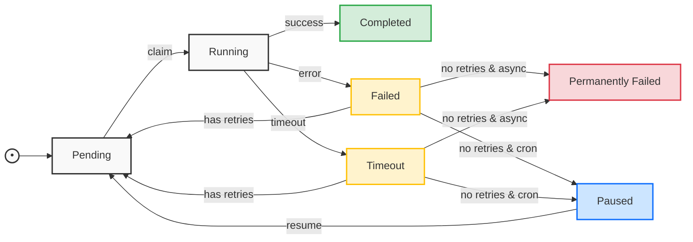

# fib-dcron

fib-dcron is a robust task scheduling system built on Fibjs, designed to help you manage and execute background tasks with reliability and flexibility. Whether you need to process one-time jobs or schedule recurring operations, fib-dcron provides a simple yet powerful solution.

## Overview

### Core Capabilities

fib-dcron offers a comprehensive task management solution with:

- **Task Scheduling**: Both one-time async tasks and recurring cron jobs
- **Reliability**: Persistent storage, automatic retries, and error recovery
- **Scalability**: Works seamlessly in single-server and distributed environments
- **Performance**: Efficient coroutine-based execution with connection pooling

### Key Features

#### Task Management
- **Async Tasks**: Schedule one-time jobs with configurable delays and priorities
- **Cron Jobs**: Set up recurring tasks using standard cron expressions
- **Priority Control**: Ensure critical tasks are processed first
- **State Tracking**: Monitor task lifecycle from creation to completion

#### Reliability & Performance
- **Automatic Retries**: Configurable retry attempts with customizable intervals
- **Timeout Protection**: Safeguard against hung or stuck tasks
- **Concurrent Processing**: Execute multiple tasks simultaneously
- **Resource Control**: Manage system load with configurable limits

#### Database Integration
- **Flexible Connectivity**: Support for connection strings, direct DB objects, and connection pools
- **Automatic Schema**: Self-managing database structure
- **Transaction Safety**: Ensure data consistency across operations
- **Connection Pooling**: Efficient database resource utilization

#### Monitoring & Administration
- **Task Inspection**: View task status, history, and execution results
- **Manual Controls**: Pause, resume, or cancel tasks as needed
- **Error Handling**: Comprehensive error tracking and recovery
- **Resource Management**: Monitor and control system resource usage

### Common Use Cases

- **Background Processing**: Handle uploads, generate reports, send notifications
- **Data Operations**: Schedule backups, run ETL jobs, perform cleanup
- **System Maintenance**: Manage caches, rotate logs, archive data
- **Periodic Updates**: Run health checks, update feeds, sync data
- **Resource Management**: Clean temporary files, enforce quotas

## Installation

Install fib-dcron via fibjs:

```bash
fibjs --install fib-dcron
```

## Getting Started

Here's a quick guide to using fib-dcron:

```javascript
const { TaskManager } = require('fib-dcron');

// Initialize task manager with options
const taskManager = new TaskManager({
    dbConnection: 'sqlite:tasks.db',  // SQLite database connection
    poll_interval: 1000,           // Poll interval in milliseconds
    max_retries: 3,               // Maximum retry attempts
    retry_interval: 300,          // Retry interval in seconds
    max_concurrent_tasks: 10      // Maximum concurrent tasks
});

// Initialize database
taskManager.db.setup();

// Register task handlers
taskManager.use('sendEmail', async (task) => {
    const { to, subject, body } = task.payload;
    await sendEmail(to, subject, body);
    return { sent: true };
});

// Start the task manager
taskManager.start();

// Add an async task
taskManager.async('sendEmail', {
    to: 'user@example.com',
    subject: 'Hello',
    body: 'World'
}, {
    delay: 0,           // Delay execution in seconds
    priority: 1,        // Task priority
    timeout: 30,        // Timeout in seconds
    max_retries: 3,     // Maximum retry attempts
    retry_interval: 60  // Retry interval in seconds
});
```

## Core Concepts

### Task Lifecycle and Execution

#### Task States

Tasks in the system follow a well-defined state machine with the following status values:

- `pending`: Task is waiting to be executed
- `running`: Task is currently being executed
- `completed`: Task has completed successfully
- `failed`: Task execution failed but may be retried
- `timeout`: Task exceeded its timeout duration
- `permanently_failed`: Task failed and exceeded retry attempts
- `paused`: Task (cron only) is paused after failures

#### State Transitions

The following diagram shows how tasks move through different states:



#### Execution Flow

1. **Task Creation**
   - User submits task via `async()` or `cron()`
   - Task is stored in database with `pending` status
   - Task options (retries, timeout, etc.) are saved

2. **Task Scheduling**
   - TaskManager polls for pending tasks
   - Tasks are claimed based on priority and schedule
   - Claimed task moves to `running` state

3. **Task Execution**
   - Handler function is called with task payload
   - Execution is monitored for timeout
   - Result or error is captured

4. **Completion Handling**
   - Success: Task moves to `completed`
   - Error/Timeout: Task moves to `failed`/`timeout`
   - Retry logic is applied if needed

5. **Retry Processing**
   - Check remaining retry attempts
   - Apply retry delay if configured
   - Move back to `pending` for retry
   - Or move to `permanently_failed`/`paused`

6. **Cron Tasks**
   - Follow same flow as async tasks
   - Can be paused after max retries
   - Can be resumed manually
   - Next schedule is calculated on completion

### Task Types

#### Async Tasks
- One-time execution tasks
- Can be scheduled with delay
- Support priority levels
- Move to `permanently_failed` after max retries

#### Cron Tasks
- Recurring tasks based on cron expression
- Automatically schedule next run
- Can be paused and resumed
- Support same retry mechanism as async tasks

### Error Handling

1. **Task Timeout**
```javascript
taskManager.use('longTask', async (task) => {
    // Periodically check for timeout
    await step1();
    task.checkTimeout();
    
    await step2();
    task.checkTimeout();
    
    return result;
});
```

2. **Task Retry**
```javascript
// Configure retry behavior
taskManager.async('retryableTask', data, {
    max_retries: 3,        // Retry up to 3 times
    retry_interval: 300    // Wait 5 minutes between retries
});
```

## Database Configuration

### Connection Options

fib-dcron supports three types of database connections:

1. **Connection String**:
```javascript
const taskManager = new TaskManager({
    dbConnection: 'sqlite:tasks.db'
});
```

2. **DB Connection Object**:
```javascript
const dbConn = db.open('sqlite:tasks.db');
const taskManager = new TaskManager({
    dbConnection: dbConn
});
```

3. **Connection Pool**:
```javascript
const pool = Pool({
    create: () => db.open('sqlite:tasks.db'),
    destroy: conn => conn.close(),
    maxsize: 5
});
const taskManager = new TaskManager({
    dbConnection: pool
});
```

### Schema Initialization

After creating a TaskManager instance, you must initialize the database schema:

```javascript
// Initialize database schema
await taskManager.db.setup();

// Now you can start using the task manager
taskManager.start();
```

The schema includes tables for:
- Tasks and their current status
- Task execution history
- Retry attempts and results
- Cron schedules

### Connection Management

The TaskManager handles connection lifecycle automatically:
- Connections are established when TaskManager starts
- Connections are properly closed when TaskManager stops
- Connection pools are managed efficiently for high concurrency
- Failed connections are retried with exponential backoff

For custom connection management, you can manually control the database connection:
```javascript
// Custom connection handling
const taskManager = new TaskManager({
    dbConnection: () => {
        const conn = db.open('sqlite:tasks.db');
        // Add custom connection setup
        return conn;
    }
});
```

## API Reference

### TaskManager

```javascript
/**
 * Create a task manager instance
 * @param {Object} options Configuration options
 * @param {string|object|function} options.dbConnection Database connection (string/object/pool)
 * @param {number} [options.poll_interval=1000] Poll interval in milliseconds
 * @param {number} [options.max_retries=3] Default maximum retry attempts
 * @param {number} [options.retry_interval=300] Default retry interval in seconds
 * @param {number} [options.max_concurrent_tasks=10] Maximum concurrent tasks
 */
constructor(options = {}) {}

/**
 * Register a task handler
 * @param {string} name Task name
 * @param {Function} handler Task handler function
 */
use(name, handler) {}

/**
 * Add an async task
 * @param {string} name Task name
 * @param {Object} payload Task data
 * @param {Object} [options] Task options
 * @param {number} [options.delay=0] Delay execution in seconds
 * @param {number} [options.priority=0] Task priority
 * @param {number} [options.timeout=60] Timeout in seconds
 * @param {number} [options.max_retries=3] Maximum retry attempts
 * @param {number} [options.retry_interval=0] Retry interval in seconds
 * @returns {number} Task ID
 */
async(name, payload, options = {}) {}

/**
 * Add a cron task
 * @param {string} name Task name
 * @param {string} cron_expr Cron expression
 * @param {Object} payload Task data
 * @param {Object} [options] Task options
 * @param {number} [options.timeout=60] Timeout in seconds
 * @param {number} [options.max_retries=3] Maximum retry attempts
 * @param {number} [options.retry_interval=0] Retry interval in seconds
 * @returns {number} Task ID
 */
cron(name, cron_expr, payload = {}, options = {}) {}

/**
 * Resume a paused cron task
 * @param {number} taskId Task ID
 * @throws {Error} If task is not found or not in paused state
 * @returns {number} Number of affected rows
 */
resumeTask(taskId) {}

/**
 * Start the task manager
 */
start() {}

/**
 * Stop the task manager
 */
stop() {}

/**
 * Retrieve task by ID
 * @param {number} taskId Task ID
 * @returns {Object} Task object
 */
getTask(taskId) {}

/**
 * Retrieve tasks by name
 * @param {string} name Task name
 * @returns {Array<Object>} Array of task objects
 */
getTasksByName(name) {}

/**
 * Retrieve tasks by status
 * @param {string} status Task status
 * @returns {Array<Object>} Array of task objects
 */
getTasksByStatus(status) {}
```

## Usage Examples

### Async Task Examples

1. **Basic Task**
```javascript
taskManager.async('processOrder', {
    orderId: '12345',
    userId: 'user789'
});
```

2. **Delayed Task**
```javascript
taskManager.async('sendReminder', {
    userId: 'user123',
    message: 'Don\'t forget to complete your profile!'
}, {
    delay: 3600  // Send reminder after 1 hour
});
```

3. **Priority Task**
```javascript
taskManager.async('sendNotification', {
    userId: 'user456',
    type: 'urgent',
    message: 'System alert!'
}, {
    priority: 10  // Higher priority task
});
```

### Cron Task Examples

1. **Daily Task**
```javascript
taskManager.cron('dailyReport', '0 0 * * *', {
    reportType: 'daily',
    recipients: ['admin@example.com']
});
```

2. **Weekly Backup**
```javascript
taskManager.cron('weeklyBackup', '0 0 * * 0', {
    backupType: 'full',
    destination: '/backups'
}, {
    timeout: 3600  // Allow up to 1 hour for backup
});
```

3. **Monthly Cleanup**
```javascript
taskManager.cron('monthlyCleanup', '0 0 1 * *', {
    older_than: '30d',
    target_dir: '/tmp'
}, {
    max_retries: 5,
    retry_interval: 600
});
```

## Cron Syntax

Cron expressions are used to define the schedule for recurring tasks. The syntax consists of six fields separated by spaces:

```
*    *    *    *    *    *
┬    ┬    ┬    ┬    ┬    ┬
│    │    │    │    │    |
│    │    │    │    │    └ day of week (0 - 7, 1L - 7L) (0 or 7 is Sun)
│    │    │    │    └───── month (1 - 12)
│    │    │    └────────── day of month (1 - 31, L)
│    │    └─────────────── hour (0 - 23)
│    └──────────────────── minute (0 - 59)
└───────────────────────── second (0 - 59, optional)
```

### Field Descriptions

1. **Second**: (optional) Specifies the exact second when the task should run. Valid values are 0-59.
2. **Minute**: Specifies the exact minute when the task should run. Valid values are 0-59.
3. **Hour**: Specifies the exact hour when the task should run. Valid values are 0-23.
4. **Day of Month**: Specifies the day of the month when the task should run. Valid values are 1-31. The character `L` can be used to specify the last day of the month.
5. **Month**: Specifies the month when the task should run. Valid values are 1-12 or JAN-DEC.
6. **Day of Week**: Specifies the day of the week when the task should run. Valid values are 0-7 (where 0 and 7 are both Sunday) or SUN-SAT. The character `L` can be used to specify the last day of the week.

### Examples

- `* * * * * *` - Every second
- `0 */5 * * * *` - Every 5 minutes
- `0 0 0 * * *` - Every day at midnight
- `0 0 9 * * 1-5` - Every weekday at 9 AM
- `0 0 12 1 * *` - At noon on the first day of every month
- `0 0 0 L * *` - At midnight on the last day of every month

### Special Characters

- `*` - Matches any value
- `,` - Separates items in a list (e.g., `MON,WED,FRI`)
- `-` - Specifies a range (e.g., `1-5`)
- `/` - Specifies increments (e.g., `*/15` for every 15 minutes)
- `L` - Last day of the month or week (e.g., `L` in the day-of-month field means the last day of the month)

Note: The `W` character (nearest weekday) is not supported.

For more complex scheduling scenarios, consult the [cron-parser documentation](https://github.com/harrisiirak/cron-parser).

## License

MIT License
