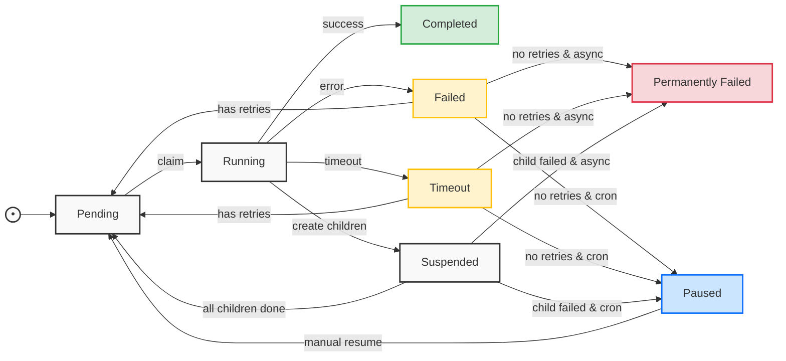

# Core Concepts

This document provides a comprehensive overview of the core concepts in fib-flow, a robust task scheduling and workflow management system. It covers essential topics including task states, state transitions, different types of tasks, and error handling mechanisms. Understanding these concepts is crucial for effectively using and implementing fib-flow in your applications.

## Table of Contents
- [Task States and Transitions](#task-states-and-transitions)
  - [Task States](#task-states)
  - [State Transitions](#state-transitions)
  - [State Diagram](#state-diagram)
- [Task Types](#task-types)
  - [Task Handler Configuration](#task-handler-configuration)
  - [Async Tasks](#async-tasks)
  - [Cron Tasks](#cron-tasks)
- [Error Handling](#error-handling)

## Task States and Transitions

### Task States

Tasks in fib-flow can be in the following states:

- `pending`: Task is waiting to be executed. Tasks start in this state and return to it when retrying.
- `running`: Task is currently being executed. The task manager actively monitors tasks in this state.
- `completed`: Task has completed successfully with no errors or timeout issues.
- `failed`: Task execution failed but may be retried based on retry configuration.
- `timeout`: Task exceeded its configured timeout duration and may be retried.
- `permanently_failed`: Async task that has failed and exceeded retry attempts, requiring manual intervention.
- `paused`: Cron task that has failed and exceeded retry attempts, can be resumed manually.
- `suspended`: Parent task waiting for child tasks to complete, manages task dependencies.

### State Transitions

Tasks follow these state transition rules:

1. Initial State
   - All tasks start in `pending` state

2. Basic Transitions
   - `pending` → `running`: Task is claimed for execution
   - `running` → `completed`: Task completes successfully
   - `running` → `failed`: Task throws an error
   - `running` → `timeout`: Task exceeds timeout duration

3. Retry Transitions
   - `failed` → `pending`: Task has remaining retry attempts
   - `timeout` → `pending`: Task has remaining retry attempts
   - `failed` → `permanently_failed`: Async task with no retries left
   - `failed` → `paused`: Cron task with no retries left
   - `timeout` → `permanently_failed`: Async task with no retries left
   - `timeout` → `paused`: Cron task with no retries left

4. Workflow Transitions
   - `running` → `suspended`: Parent task creates child tasks
   - `suspended` → `pending`: All child tasks completed successfully
   - `suspended` → `permanently_failed`: Async parent task when any child fails
   - `suspended` → `paused`: Cron parent task when any child fails

5. Recovery Transitions
   - `paused` → `pending`: Manually resume a paused cron task

### State Diagram



## Task Types

### Task Handler Configuration
Task handlers can be registered in two forms:
- Function Form: Direct handler registration with global defaults
- Object Form: Registration with task-specific configuration options

```javascript
// Function form - uses global defaults
taskManager.use('simpleTask', async (task) => {
    return { result: 'done' };
});

// Object form - with task-specific defaults
taskManager.use('complexTask', {
    handler: async (task) => {
        return { result: 'done' };
    },
    timeout: 120,       // Task-specific timeout
    max_retries: 2,     // Task-specific retry limit
    retry_interval: 30, // Task-specific retry interval
    priority: 5         // Task-specific priority
});
```

### Async Tasks
- One-time execution tasks that run exactly once
- Can be scheduled with delay using milliseconds or Date objects
- Support configurable priority levels
- Move to `permanently_failed` after max retries
- Can specify dependencies on other tasks to create workflows

### Cron Tasks
- Recurring tasks based on cron expression (e.g., "0 * * * *" for hourly)
- Automatically schedule next run after completion
- Can be paused and resumed through API calls
- Support same retry mechanism as async tasks with configurable intervals
- Support task chaining through dependencies for complex schedules

## Error Handling

1. **Task Timeout**
```javascript
taskManager.use('longTask', async (task) => {
    // Periodically check for timeout
    await step1();
    task.checkTimeout();
    
    await step2();
    task.checkTimeout();
    
    return result;
});
```

2. **Task Retry**
```javascript
// Configure retry behavior
taskManager.async('retryableTask', data, {
    max_retries: 3,        // Maximum 3 total attempts (initial + 2 retries)
    retry_interval: 300
});
```

3. **Error Propagation**
```javascript
taskManager.use('errorTask', async (task) => {
    try {
        await riskyOperation();
    } catch (error) {
        // Task will automatically be retried or marked as failed
        throw new Error('Operation failed: ' + error.message);
    }
});
```
